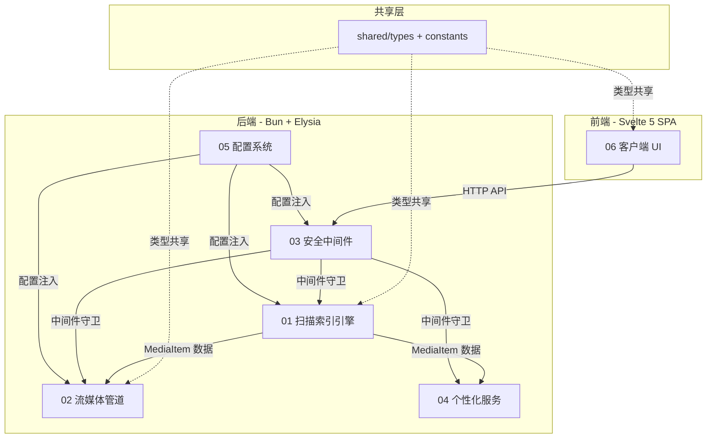

# MSP 系统架构概览 (Architecture Overview)

> 本文档是 MSP 实现方案的**总纲**，定义技术栈、项目骨架、模块划分与实施阶段。
> 各模块的精细设计详见对应的子文档。

---

## 1. 技术栈选型决策

基于 URS §6.2 的三种方案对比，选定 **高开发效率方案**：

| 层级 | 选型 | 决策理由 |
|:---|:---|:---|
| **运行时** | **Bun** (>= 1.x) | 原生 SQLite 驱动、极速文件 I/O、`Bun.spawn()` 管道控制力强、TS 一等公民 |
| **后端框架** | **Elysia** (Bun-native HTTP) | 零额外依赖、类型安全路由、中间件链式组合、性能接近原始 Bun.serve |
| **前端框架** | **Svelte 5** (Runes 模式) | 编译时优化、零运行时开销、`$state`/`$effect` 响应系统精细控制 |
| **构建工具** | **Vite** (via SvelteKit static adapter 或纯 Vite + svelte plugin) | 极速 HMR、tree-shaking、SPA 模式打包 |
| **存储** | **Bun:SQLite** (嵌入式) | 零外部依赖、WAL 模式高并发读写、单文件部署 |
| **样式** | **Vanilla CSS** (CSS Custom Properties + HSL 体系) | 最大灵活性、零构建依赖、与 Glassmorphism 效果完美配合 |
| **转码** | **FFmpeg / FFprobe** (系统级子进程) | 通过 `Bun.spawn()` 管道 stdout → HTTP Response 流式传输 |

### 1.1 关键约束

- **纯 SPA 模式**：前端不使用 SSR，编译产物为纯静态资源（HTML/JS/CSS）
- **单产物部署**：打包阶段将前端静态资源嵌入后端，交付单启动目录
- **FFmpeg 可选**：无 FFmpeg 时仅禁用转码和缩略图，直连播放不受影响
- **TypeScript 全栈**：前后端统一 TypeScript，共享类型定义

---

## 2. 项目目录结构

```
mspr/
├── docs/                          # 架构与设计文档
│   └── architecture/              # 本系列文档
│
├── packages/                      # Monorepo 工作区
│   ├── shared/                    # 前后端共享类型与常量
│   │   └── src/
│   │       ├── types/             # 共享 TypeScript 接口
│   │       │   ├── media.ts       # MediaItem, Share, Subtitle 等
│   │       │   ├── api.ts         # API 请求/响应类型
│   │       │   └── config.ts      # 配置数据结构
│   │       └── constants/         # 共享常量（扩展名映射、默认值等）
│   │           ├── extensions.ts
│   │           └── defaults.ts
│   │
│   ├── server/                    # Bun + Elysia 后端
│   │   ├── src/
│   │   │   ├── index.ts           # 入口：启动 HTTP 服务器
│   │   │   ├── app.ts             # Elysia 应用实例组装
│   │   │   ├── config/            # 配置加载与热重载
│   │   │   ├── db/                # SQLite 数据层
│   │   │   ├── scanner/           # 文件扫描与索引引擎
│   │   │   ├── streaming/         # 流式传输与转码管道
│   │   │   ├── security/          # IP 过滤、PIN 认证、路径沙箱
│   │   │   ├── middleware/        # 通用中间件（鉴权、限流、日志）
│   │   │   ├── routes/            # API 路由定义
│   │   │   └── utils/             # 工具函数
│   │   ├── static/                # 前端构建产物嵌入目录
│   │   └── data/                  # 运行时数据目录
│   │       ├── mspr.db            # SQLite 数据库文件
│   │       ├── thumbnails/        # 缩略图缓存
│   │       └── config.json        # 用户配置文件
│   │
│   └── client/                    # Svelte 5 SPA 前端
│       ├── src/
│       │   ├── App.svelte         # 根组件
│       │   ├── main.ts            # SPA 入口
│       │   ├── lib/               # 核心库
│       │   │   ├── stores/        # 全局状态管理 ($state)
│       │   │   ├── api/           # API 客户端封装
│       │   │   ├── utils/         # 前端工具函数
│       │   │   └── player/        # 播放器核心引擎
│       │   ├── components/        # UI 组件库
│       │   │   ├── layout/        # 布局组件（侧边栏、导航、响应式壳）
│       │   │   ├── media/         # 媒体展示组件（卡片、列表、网格）
│       │   │   ├── player/        # 播放器 UI 组件
│       │   │   ├── settings/      # 设置页组件
│       │   │   └── common/        # 通用 UI 原子组件
│       │   ├── pages/             # 页面级组件
│       │   ├── styles/            # 全局样式
│       │   │   ├── tokens.css     # CSS 变量与设计令牌
│       │   │   ├── base.css       # 重置与基础样式
│       │   │   ├── animations.css # 微动画定义
│       │   │   └── themes.css     # 暗/亮主题切换
│       │   └── assets/            # 静态资源（图标、字体）
│       └── vite.config.ts
│
├── user_requirements_specification.md
├── package.json                   # Monorepo 根配置
├── bunfig.toml                    # Bun 工作区配置
└── tsconfig.json                  # 根 TypeScript 配置
```

---

## 3. 六大核心模块

MSP 系统被拆分为 **6 个松耦合核心模块**，每个模块有独立的设计文档：

| # | 模块名称 | 文档 | 关键职责 |
|:--|:---|:---|:---|
| 01 | 共享与索引引擎 | [01-scanner-indexer.md](./01-scanner-indexer.md) | 目录注册、智能分类扫描、黑名单过滤、Sidecar 关联、元数据缓存 |
| 02 | 流媒体与转码管道 | [02-streaming-transcoding.md](./02-streaming-transcoding.md) | 播放策略决策树、直连/转码分流、FFmpeg 管道、硬件加速、并发控制 |
| 03 | 安全与访问控制 | [03-security-access.md](./03-security-access.md) | IP 黑白名单、PIN 认证/Session、路径沙箱防遍历、速率限制 |
| 04 | 个性化与辅助功能 | [04-personalization-ux.md](./04-personalization-ux.md) | 断点续播、播放历史、收藏夹、字幕转换、歌词同步、浏览模式 |
| 05 | 管理与配置系统 | [05-management-config.md](./05-management-config.md) | 配置热重载、前端日志上报、运行时参数管理 |
| 06 | 客户端 UI 与交互 | [06-client-ui.md](./06-client-ui.md) | 响应式布局、主题系统、微动画、播放器 UI、快捷键、虚拟目录树 |

---

## 4. 模块依赖关系



---

## 5. 实施阶段规划

整个项目分 **4 个阶段**递进实施，每阶段交付可运行的最小增量：

### Phase 1 — 基础骨架（可浏览）
- [ ] Monorepo 初始化（Bun workspace + TypeScript）
- [ ] 共享类型定义（`packages/shared`）
- [ ] SQLite Schema 建表与 DAO 层
- [ ] 配置文件加载（`config.json` 解析）
- [ ] 文件扫描引擎（含黑名单过滤）
- [ ] `/api/media` 端点（返回扁平媒体列表）
- [ ] 前端骨架（Svelte 5 + Vite + 路由）
- [ ] 媒体列表渲染（网格/列表视图）
- [ ] 暗色主题基础样式系统

### Phase 2 — 核心播放（可播放）
- [ ] 直连流式传输（`/api/stream` + Range 支持）
- [ ] 播放策略探测（`/api/probe`）
- [ ] FFmpeg 转码管道（fragmented MP4 流式输出）
- [ ] 硬件加速检测与回退
- [ ] 并发转码上限控制
- [ ] 视频/音频播放器 UI（含控制栏）
- [ ] 缩略图生成与缓存（`/api/thumbnail`）
- [ ] 图片查看器

### Phase 3 — 安全与个性化（可使用）
- [ ] IP 黑白名单中间件
- [ ] PIN 码认证与 Session 管理
- [ ] 路径沙箱校验
- [ ] 速率限制
- [ ] 断点续播（进度保存/恢复）
- [ ] 播放历史记录
- [ ] 收藏夹功能
- [ ] 字幕在线转换（SRT/ASS → VTT）
- [ ] LRC 歌词同步滚动

### Phase 4 — 体验打磨（可交付）
- [ ] 配置热重载（FileWatcher）
- [ ] 前端日志上报
- [ ] 全局搜索功能
- [ ] 快捷键系统
- [ ] 响应式移动端适配
- [ ] 微动画与过渡效果打磨
- [ ] 亮色主题
- [ ] 前端构建产物嵌入后端
- [ ] 单目录部署打包

---

## 6. 文档索引

| 文件 | 内容说明 |
|:---|:---|
| `00-overview.md` | **本文档** — 总体架构概览 |
| `01-scanner-indexer.md` | 扫描索引引擎详细设计 |
| `02-streaming-transcoding.md` | 流媒体与转码管道详细设计 |
| `03-security-access.md` | 安全与访问控制详细设计 |
| `04-personalization-ux.md` | 个性化与辅助功能详细设计 |
| `05-management-config.md` | 管理与配置系统详细设计 |
| `06-client-ui.md` | 客户端 UI 与交互详细设计 |
| `07-database-schema.md` | 数据库 Schema 与数据层设计 |
| `08-api-contracts.md` | API 接口契约与通讯协议 |
| `09-shared-types.md` | 共享类型与常量定义 |

---

## 7. AI 实施弹性与容错指南 (AI Implementation Flexibility & Fault-Tolerance Guidelines)

> [!IMPORTANT]
> 本系列设计文档中的具体代码实现、算法细节、目录划分与技术栈版本**仅作为高标准的设计参考（Spec）**。在实际编写代码实施阶段，如果遇到技术不兼容、包依赖冲突、环境差异或性能问题，**实施 AI 具有完全的自主裁量权进行灵活调整和降级容错处理**。

### 7.1 架构与目录弹性
*   **Monorepo vs Flat Structure**: 默认推荐的 `packages/` 工作区多包结构是为了代码解耦。如果遇到打包配置复杂或 Bun Workspace 依赖解析问题，实施 AI 可以直接将其扁平化为单项目结构（如将 `client` 作为 `server/static` 源码目录，或者直接合为一个整体工程）。
*   **框架与语言降级**:
    *   *后端*: 若 Elysia 因 TypeScript 版本或 Bun 版本出现兼容问题，可随时替换为原生 `Bun.serve`、`Express`、`Koa` 或 `Fastify`。
    *   *前端*: 若 Svelte 5 的 Runes 语法（`$state`, `$effect`）在当前依赖环境下运行异常，可平滑降级使用 Svelte 4 传统语法或 React/Vue。

### 7.2 代码与算法弹性
*   **避免造轮子**: 设计文档中提供的算法（如 `03` 中的 CIDR 掩码转换、`04` 中的 SRT/ASS 转 VTT 正则、`04` 中的 LRC 解析）为概念模型。在实际开发中，AI 应当**优先引入成熟、经过社区验证的轻量级 npm 依赖**（如 `ip-range-check`、`lrc-parser` 等），以保障健壮性，仅在无合适依赖时才手动实现。
*   **路径与沙箱安全性**: 针对 `03-security-access.md` 中定义的路径沙箱，在 Windows 和 Linux/macOS 系统下路径格式存在差异（`\` 与 `/`，盘符如 `C:`），实施 AI 必须使用 `path.normalize` 或 `path.resolve` 进行跨平台处理，防止逻辑失效。

### 7.3 转码与流媒体容错 (Graceful Degradation)
*   **FFmpeg 命令行调整**: FFmpeg 的参数组合非常依赖本地环境。若特定硬件加速参数（如 `h264_nvenc` 或 `h264_qsv`）在宿主机上报错，转码引擎应当能够**捕获该错误，并无缝自动降级到 CPU 软解转码（`libx264`）**，甚至降级到**强制直连流传输**，防止播放完全卡死。
*   **分块传输与启播优化**: 若 Fragmented MP4 的 `movflags` 参数引发某些非主流浏览器花屏或无声，AI 可灵活改用普通的 HTTP 渐进式流式输出，或使用更兼容的 HLS (HTTP Live Streaming) 进行切片。

### 7.4 数据库与持久化弹性
*   **SQLite 驱动**: 默认使用 `bun:sqlite`。如果实际开发中引入了 ORM（如 Prisma, Drizzle, Kysely）或者因开发环境需要使用经典的 `better-sqlite3`，AI 可以自由更改数据层 API，不必拘泥于文档中的 `Prepared Statements` 手动事务。
*   **Schema 字段微调**: 允许根据前端界面的实际需要，自由增加、修改或废弃数据表字段（例如为播放历史增加“总时长”以计算进度百分比）。

