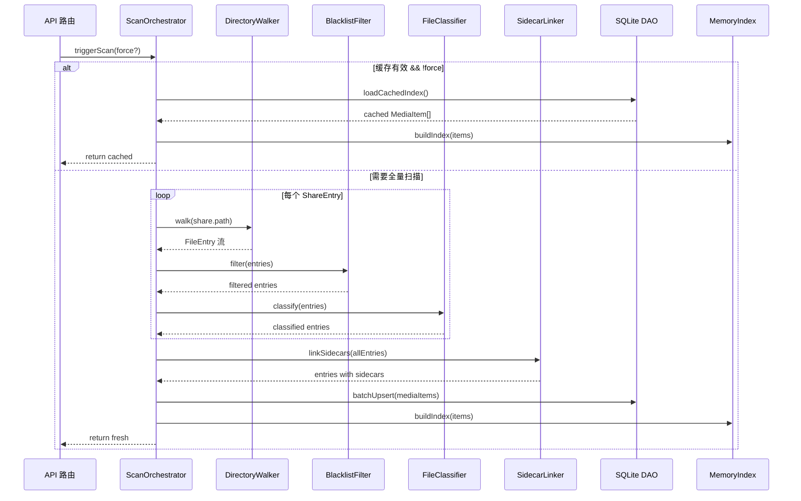

# 模块 01 — 共享与索引引擎 (Scanner & Indexer)

> 对应 URS §2.1  
> 负责共享目录注册、文件扫描分类、黑名单过滤、Sidecar 关联、缓存更新

---

## 1. 模块职责边界


---

## 2. 子模块设计

### 2.1 共享目录注册 (ShareRegistry)

**文件位置**: `server/src/scanner/share-registry.ts`

**职责**:
- 管理共享目录列表的 CRUD
- 维护 `label → absolutePath` 的映射表
- 启动时验证目录存在性，不存在则发出 WARN 日志但不阻断启动

**数据结构**:
```
ShareEntry {
  label: string       // 唯一别名（如 "电影", "音乐"）
  path: string        // 系统绝对路径
  enabled: boolean    // 是否启用
}
```

**设计要点**:
- `label` 必须唯一，注册时做去重校验
- `path` 标准化处理：统一为 forward-slash、移除尾部斜杠
- 提供 `getShareByLabel(label)` 和 `resolveAbsolutePath(label, relPath)` 查询方法
- 配置变更时由 ConfigWatcher 触发重新加载

---

### 2.2 目录遍历器 (DirectoryWalker)

**文件位置**: `server/src/scanner/directory-walker.ts`

**职责**:
- 递归遍历指定物理目录下的全部文件与子目录
- 生成标准化的 `FileEntry` 流（迭代器模式），包含路径、大小、修改时间等元信息
- 不进行任何过滤或分类（单一职责）

**遍历策略**:
- 使用 Bun 的 `readdir` + `stat` 或 `Bun.Glob` 进行文件系统遍历
- 采用**广度优先 (BFS)** 遍历，避免深层嵌套目录导致栈溢出
- 产出数据格式：

```
FileEntry {
  absolutePath: string    // 绝对路径
  relativePath: string    // 相对于 Share 根的路径
  name: string            // 文件名（含扩展名）
  baseName: string        // 文件名（不含扩展名）
  ext: string             // 扩展名（小写、无点）
  size: number            // 字节大小
  modTime: number         // 修改时间戳 (Unix ms)
  isDirectory: boolean    // 是否为目录
}
```

**性能目标**:
- 万级文件在 3 秒内完成遍历（URS §3.2 要求）
- 利用 Bun 原生文件 API 而非 Node.js polyfill

---

### 2.3 黑名单过滤器 (BlacklistFilter)

**文件位置**: `server/src/scanner/blacklist-filter.ts`

**职责**:
- 根据配置的黑名单规则过滤 `FileEntry`
- 支持四种维度的过滤（URS §2.1.3）

**过滤规则数据结构**:
```
BlacklistConfig {
  extensions: FilterRule[]     // 扩展名黑名单
  filenames: FilterRule[]      // 文件名黑名单
  directories: FilterRule[]    // 目录黑名单
  sizeFilter: {
    minBytes?: number          // 过滤小于此值的文件
    maxBytes?: number          // 过滤大于此值的文件
  }
}

FilterRule {
  pattern: string              // 匹配模式
  isRegex: boolean             // 是否为正则表达式（否则为精确匹配）
}
```

**过滤执行流程**:

```
FileEntry 输入
  │
  ├── 1. 目录路径检查：relativePath 是否命中 directories 黑名单
  │     → 命中则跳过整个目录（含子目录）
  │
  ├── 2. 扩展名检查：ext 是否命中 extensions 黑名单
  │     → 命中则过滤此文件
  │
  ├── 3. 文件名检查：name 是否命中 filenames 黑名单
  │     → 支持精确匹配 或 正则匹配
  │
  └── 4. 大小检查：size 是否超出 sizeFilter 范围
        → 超出范围则过滤
```

**设计要点**:
- 正则表达式需预编译缓存（`new RegExp()` 在初始化时执行一次）
- 目录黑名单在遍历阶段即可剪枝，避免进入被屏蔽的目录
- 默认内置黑名单规则：`$RECYCLE.BIN`, `.git`, `.DS_Store`, `thumbs.db`, `desktop.ini`
- 大小单位解析函数：支持 `B`, `KB`, `MB`, `GB`, `TB` 的字符串解析

---

### 2.4 文件分类器 (FileClassifier)

**文件位置**: `server/src/scanner/file-classifier.ts`

**职责**:
- 根据文件扩展名将 `FileEntry` 归类为 `video | audio | image | other`
- 提供扩展名 → 分类的快速查表

**分类映射表** (来自 URS §2.1.2):

```
VIDEO_EXTENSIONS = Set { mp4, mkv, avi, mov, wmv, flv, webm, ts, m4v }
AUDIO_EXTENSIONS = Set { mp3, wav, flac, aac, ogg, m4a, wma, ape }
IMAGE_EXTENSIONS = Set { jpg, jpeg, png, gif, webp, bmp, svg }
SUBTITLE_EXTENSIONS = Set { srt, vtt, ass, ssa }
LYRICS_EXTENSIONS = Set { lrc }

classify(ext: string): MediaKind
  → 精确查 Set，O(1) 时间复杂度
  → 不在任何 Set 中的归为 "other"
```

**设计要点**:
- 扩展名映射表从 `packages/shared/src/constants/extensions.ts` 导入（前后端共享）
- 字幕和歌词扩展名独立维护，用于 Sidecar 扫描，但不作为 MediaItem 的 kind

---

### 2.5 辅助文件关联器 (SidecarLinker)

**文件位置**: `server/src/scanner/sidecar-linker.ts`

**职责**:
- 在扫描完成后，为视频文件关联同目录下的字幕文件
- 为音频文件关联同目录下的歌词文件和封面文件
- 输出关联关系写入 MediaItem 的元数据字段

**字幕关联规则** (URS §2.1.4):
```
对于视频文件 "movie.mkv":
  1. 精确同名匹配: movie.srt, movie.vtt, movie.ass
  2. 语言标识匹配: movie.zh.srt, movie.en.srt, movie.chs.ass
  3. 提取 label: 文件名去除主名后的中间部分作为语言标签
     例: "movie.Chinese(Simplified).srt" → label="Chinese(Simplified)"
```

**歌词关联规则**:
```
对于音频文件 "song.flac":
  1. 精确同名: song.lrc
```

**封面关联规则**:
```
对于音频文件 "song.flac":
  1. 同名封面: song.jpg, song.png, song.webp
  2. 通用封面: cover.jpg, cover.png, folder.jpg, folder.png
     (取目录下第一个命中的)
```

**数据输出**:
```
SubtitleMeta {
  id: string          // 基于路径哈希生成
  label: string       // 语言/标识标签
  lang: string        // 语言代码 (如 "zh", "en")
  srcPath: string     // 字幕文件绝对路径（服务端内部使用）
  isDefault: boolean  // 是否为默认字幕（第一个匹配的为 true）
}
```

**关联算法**:
- 基于**目录级分组**：先将文件按目录分组，再在组内做关联匹配
- 避免全局搜索，限制在同目录范围内查找

---

### 2.6 ID 生成策略

**文件位置**: `server/src/scanner/id-generator.ts`

**职责**:
- 为每个 MediaItem 生成确定性唯一 ID
- 保证同一文件在多次扫描中产生相同 ID（进度、收藏数据不丢失）

**生成算法**:
```
mediaId = SHA256( shareLabel + ":" + relativePath ).hex().slice(0, 16)
```

**设计考量**:
- 使用 `shareLabel + relativePath` 而非绝对路径，保证跨平台路径兼容
- SHA256 前 16 位 hex（64bit 空间），在单库规模下碰撞概率可忽略
- 字幕/歌词/封面的 ID 使用相同策略（以其自身的 shareLabel + relPath 计算）

---

### 2.7 扫描编排器 (ScanOrchestrator)

**文件位置**: `server/src/scanner/scan-orchestrator.ts`

**职责**:
- 协调以上全部子模块的执行流程
- 管理扫描状态（进行中/完成）
- 将扫描结果写入 SQLite 缓存并构建内存索引

**扫描流程**:



**缓存策略**:
- SQLite 中存储 `MediaScan` 元记录（scanId, builtAt, complete）
- 每次启动时检查缓存是否存在且 `complete=true`
- 首次启动或手动 `?refresh=1` 时触发全量扫描
- 扫描期间设置 `scanInProgress` 标志，防止并发重入
- 扫描完成后构建内存级 `Map<id, MediaItem>` 索引，供其他模块 O(1) 查询

---

## 3. 内存索引 (MediaIndex)

**文件位置**: `server/src/scanner/media-index.ts`

**职责**:
- 维护 MediaItem 的内存索引，提供快速查询接口
- 供流媒体模块、个性化模块等直接引用

**索引结构**:
```
MediaIndex {
  byId:         Map<string, MediaItem>           // ID 快查
  byKind:       Map<MediaKind, MediaItem[]>       // 按分类查
  byShare:      Map<string, MediaItem[]>          // 按共享目录查
  allItems:     MediaItem[]                       // 全量列表（前端 GET /media 返回）
}
```

**查询接口**:
- `getById(id: string): MediaItem | null`
- `getByKind(kind: MediaKind): MediaItem[]`
- `getByShare(label: string): MediaItem[]`
- `getAll(): MediaItem[]`
- `search(query: string): MediaItem[]` — 基于文件名的模糊搜索

**搜索算法**:
- 简单的 `includes()` 字符串匹配，对 `name` 字段进行匹配
- 后续可升级为 FTS5 全文检索或 Fuse.js 模糊搜索

---

## 4. 文件变更检测

**配合 05-配置模块的热重载**:
- 当共享目录列表变更时，ConfigWatcher 通知 ScanOrchestrator 重新扫描
- 不实现实时文件监控（inotify/FSEvents），依赖手动刷新或定时检查
- 扫描是全量替换式（先清空旧数据，写入新数据），保证一致性

---

## 5. 对外接口（供其他模块调用）

| 方法 | 调用方 | 说明 |
|:---|:---|:---|
| `getMediaIndex()` | 流媒体模块、个性化模块 | 获取当前内存索引实例 |
| `getItemById(id)` | 流媒体模块（流式传输） | 根据 ID 获取单个 MediaItem（含绝对路径） |
| `triggerScan(force)` | API 路由（`POST /media/refresh`） | 触发扫描 |
| `getShareRegistry()` | 安全模块（路径沙箱验证） | 获取注册的共享目录列表 |

---

## 6. 安全注意事项

- `MediaItem.path`（绝对路径）**绝不可**出现在 API 响应中
- API 返回的媒体数据仅包含 `id`, `relPath`, `name`, `ext`, `kind`, `shareLabel`, `size`, `modTime`
- 所有涉及路径的操作均通过 ID → 内部查表 → 绝对路径，外部无法构造路径
