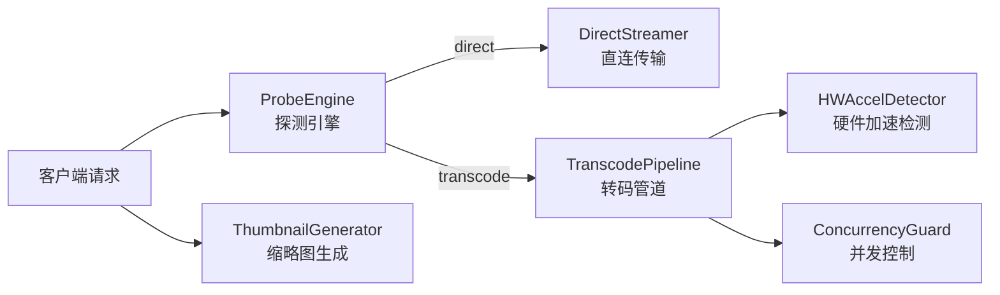
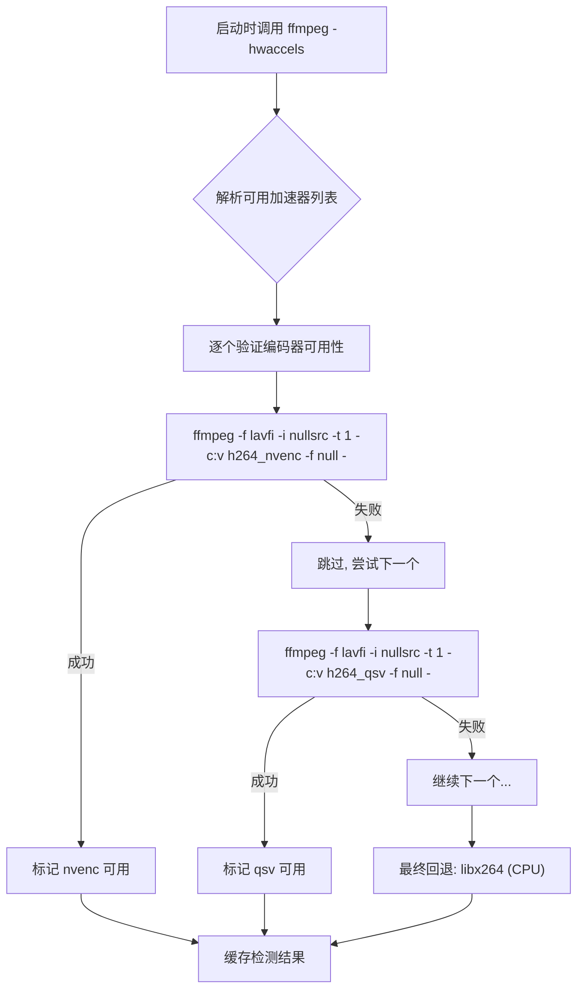
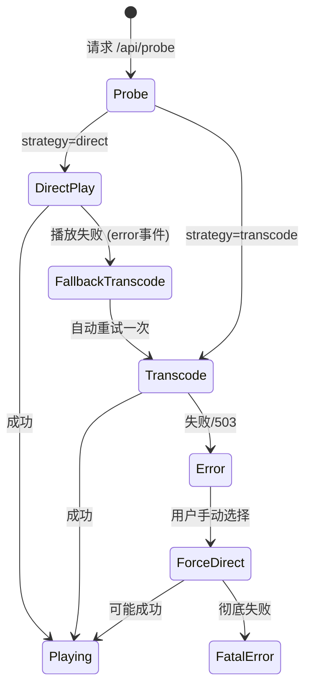

# 模块 02 — 流媒体与转码管道 (Streaming & Transcoding)

> 对应 URS §2.2  
> 负责播放策略决策、直连传输、FFmpeg 转码管道、硬件加速、并发控制、缩略图生成

---

## 1. 模块职责边界



---

## 2. 子模块设计

### 2.1 编解码探测引擎 (ProbeEngine)

**文件位置**: `server/src/streaming/probe-engine.ts`

**职责**:
- 分析媒体文件的容器格式与编解码信息
- 输出播放策略决策（direct / transcode / force-direct）

**两级探测策略**:

```
Level 1 — 容器格式快速判断（零 FFprobe 调用）
  │
  ├── 根据扩展名进行预判：
  │   ├── mp4, webm, ogg, mp3, wav, aac → 大概率直连
  │   ├── mkv, avi, wmv, flv, ts, m4v → 需要进一步探测编码
  │   └── wma, ape, flac (audio) → 需要检查浏览器兼容性
  │
  ▼
Level 2 — FFprobe 编码探测（仅在 Level 1 无法确定时调用）
  │
  ├── 调用 FFprobe JSON 输出，解析 codec_name / codec_type
  ├── 视频流: h264 → direct, hevc/vc1/mpeg4/msmpeg4v3 → transcode
  ├── 音频流: aac/mp3/opus/vorbis/pcm → direct, ac3/dts/truehd/flac(video内) → transcode
  └── 缓存探测结果（基于 mediaId），避免重复调用 FFprobe
```

**浏览器兼容性查表** (硬编码):

| 编码 | 容器 | 主流浏览器支持 | 决策 |
|:---|:---|:---|:---|
| H.264 | MP4/MKV(remux) | ✅ Chrome, Firefox, Safari, Edge | Direct (MP4) / Remux (MKV→fMP4) |
| H.265/HEVC | MP4 | ⚠️ Safari 仅, Chrome 部分 | Transcode |
| VP9 | WebM | ✅ Chrome, Firefox, Edge | Direct |
| AV1 | MP4/WebM | ⚠️ 新版浏览器 | Direct（回退 transcode） |
| AAC | MP4/M4A | ✅ 全支持 | Direct |
| MP3 | MP3 | ✅ 全支持 | Direct |
| Opus | WebM/OGG | ✅ Chrome, Firefox | Direct |
| AC-3/EAC-3 | * | ❌ | Transcode |
| DTS/TrueHD | * | ❌ | Transcode |
| FLAC | * | ⚠️ Chrome, Edge | 条件 Direct |

**ProbeResult 输出结构**:
```
ProbeResult {
  mediaId: string
  strategy: "direct" | "transcode" | "remux"
  container: string            // 源容器格式
  videoCodec: string | null    // 源视频编码
  audioCodec: string | null    // 源音频编码
  needVideoTranscode: boolean  // 视频流是否需要转码
  needAudioTranscode: boolean  // 音频流是否需要转码
  duration: number             // 总时长（秒）
  width: number | null         // 视频宽度
  height: number | null        // 视频高度
}
```

**FFprobe 调用规范**:
```
ffprobe -v quiet -print_format json -show_format -show_streams "{filePath}"
```
- 使用 `Bun.spawn()` 调用，读取 stdout JSON
- 设置超时（5 秒），超时则回退为 force-direct
- FFprobe 不存在时直接返回 force-direct（仅基于 Level 1 判断）

---

### 2.2 直连流传输器 (DirectStreamer)

**文件位置**: `server/src/streaming/direct-streamer.ts`

**职责**:
- 直接读取物理文件并流式传输给客户端
- 支持 HTTP Range 请求（视频拖动/快进）
- 设置正确的 Content-Type 和 Content-Length

**Range 请求处理流程**:
```
1. 解析请求头 Range: bytes=START-END
2. 验证范围合法性
3. 打开文件句柄，seek 到 START 位置
4. 设置响应头:
   - HTTP 206 Partial Content
   - Content-Range: bytes START-END/TOTAL
   - Content-Length: END - START + 1
   - Accept-Ranges: bytes
5. 以 ReadableStream 流式传输指定范围
```

**无 Range 请求时**:
- 返回 HTTP 200 + 完整文件流
- 设置 Content-Length 为文件总大小

**MIME 类型映射**:
```
mp4 → video/mp4
webm → video/webm
mkv → video/x-matroska
mp3 → audio/mpeg
flac → audio/flac
wav → audio/wav
aac → audio/aac
ogg → audio/ogg
m4a → audio/mp4
（其余使用 application/octet-stream）
```

---

### 2.3 转码管道 (TranscodePipeline)

**文件位置**: `server/src/streaming/transcode-pipeline.ts`

**职责**:
- 启动 FFmpeg 子进程进行实时流式转码
- stdout → HTTP Response 管道传输（零磁盘写入）
- 支持从指定时间偏移量开始转码
- 支持转码中止（客户端断开时杀死 FFmpeg 进程）

**核心设计原则** (URS §2.2.2):
- ❌ **绝不**生成临时文件
- ✅ FFmpeg stdout 直接 pipe 到 HTTP 响应流
- ✅ 使用 fragmented MP4 (fMP4) 实现快速启播

**视频转码 FFmpeg 命令模板**:
```
ffmpeg
  -ss {offset}                          # 起始偏移（秒）
  {hwAccelInputFlags}                   # 硬件解码参数（可选）
  -i "{inputPath}"                      # 输入文件
  -map 0:v:0 -map 0:a:0                 # 选取第一个视频流和音频流
  {videoCodecFlags}                     # 视频编码参数
  {audioCodecFlags}                     # 音频编码参数
  -movflags frag_keyframe+empty_moov+default_base_moof
  -f mp4                                # 输出 fragmented MP4
  pipe:1                                # 输出到 stdout
```

**视频编码参数决策**:
```
if (needVideoTranscode):
  if (hwAccel === "nvenc"):
    -c:v h264_nvenc -preset p4 -crf 23
  elif (hwAccel === "qsv"):
    -c:v h264_qsv -preset medium
  elif (hwAccel === "vaapi"):
    -c:v h264_vaapi
  elif (hwAccel === "videotoolbox"):
    -c:v h264_videotoolbox -q:v 65
  else:
    -c:v libx264 -preset veryfast -crf 23
else:
  -c:v copy                              # 视频流直通
```

**音频编码参数决策**:
```
if (needAudioTranscode):
  -c:a aac -b:a 192k -ac 2             # 强制 AAC 立体声
else:
  -c:a copy                              # 音频流直通
```

**音频专用转码** (非视频文件):
```
ffmpeg
  -i "{inputPath}"
  -c:a libmp3lame -b:a 192k
  -f mp3
  pipe:1
```

**进程生命周期管理**:
```
1. Bun.spawn() 启动 FFmpeg，获取 subprocess 对象
2. subprocess.stdout → ReadableStream → HTTP Response body
3. 监听客户端连接关闭 (AbortSignal):
   → subprocess.kill("SIGTERM")
   → 等待 500ms
   → 若未退出则 subprocess.kill("SIGKILL")
4. 监听 subprocess.exited:
   → 退出码 != 0 则记录错误日志
5. 从 ConcurrencyGuard 释放槽位
```

**响应头**:
```
Content-Type: video/mp4  (或 audio/mpeg)
Transfer-Encoding: chunked
Cache-Control: no-cache
X-MSP-Transcode: active
```

---

### 2.4 硬件加速检测器 (HWAccelDetector)

**文件位置**: `server/src/streaming/hw-accel-detector.ts`

**职责**:
- 服务启动时检测系统可用的硬件加速方案
- 缓存检测结果，避免每次转码重新检测

**检测流程**:


**检测优先级顺序**:
1. **NVENC** (Nvidia GPU) — `h264_nvenc`
2. **QSV** (Intel iGPU/dGPU) — `h264_qsv`
3. **AMF** (AMD GPU) — `h264_amf`
4. **VideoToolbox** (macOS) — `h264_videotoolbox`
5. **VAAPI** (Linux) — `h264_vaapi`
6. **CPU 回退** — `libx264`

**输出结构**:
```
HWAccelResult {
  available: string[]          // 可用的加速器名称列表
  preferred: string | "cpu"    // 首选加速器
  encoderMap: {
    [accelName]: string        // 加速器 → 编码器名称映射
  }
}
```

**设计要点**:
- 检测只在启动时执行一次，结果内存缓存
- 无 FFmpeg 时整个检测跳过，`preferred = "unavailable"`
- 转码时若首选硬件编码失败，自动回退 CPU（记录 WARN 日志）

---

### 2.5 并发控制守卫 (ConcurrencyGuard)

**文件位置**: `server/src/streaming/concurrency-guard.ts`

**职责**:
- 控制同时进行的转码任务数量（URS §2.2.3）
- 提供获取/释放转码槽位的接口
- 超过上限时返回 HTTP 503 Service Unavailable

**设计**:
```
ConcurrencyGuard {
  maxJobs: number              // 从配置读取，默认 2
  activeJobs: Map<string, {    // 当前活跃的转码任务
    mediaId: string
    pid: number                // FFmpeg 进程 PID
    startedAt: number          // 开始时间
  }>

  acquire(mediaId): boolean    // 尝试获取槽位
  release(mediaId): void       // 释放槽位
  getStatus(): {               // 获取当前状态
    active: number
    max: number
    jobs: JobInfo[]
  }
}
```

**超限处理**:
- 返回 HTTP 503 + JSON `{ error: "transcode_limit_reached", active: N, max: M }`
- 客户端收到 503 后展示"服务器转码繁忙"提示，可选择等待或强制直连

---

### 2.6 缩略图生成器 (ThumbnailGenerator)

**文件位置**: `server/src/streaming/thumbnail-generator.ts`

**职责**:
- 为视频文件生成预览缩略图
- 实现缓存-未命中-生成-存储策略

**生成流程**:
```
GET /api/thumbnail?id=xxx
  │
  ├── 1. 计算缓存路径: data/thumbnails/{mediaId}.webp
  │
  ├── 2. 检查缓存文件是否存在
  │     ├── 存在 → 直接返回 webp 文件
  │     └── 不存在 → 继续生成
  │
  ├── 3. 从 MediaIndex 获取文件绝对路径
  │
  ├── 4. 调用 FFmpeg 截取帧:
  │     ffmpeg -ss 10 -i "{path}" -vframes 1 -vf "scale=320:-1"
  │           -f image2pipe -c:v webp pipe:1
  │     (捕获视频第 10 秒的帧，缩放到宽 320px，输出 WebP)
  │
  ├── 5. 将 stdout 写入缓存文件
  │
  └── 6. 返回生成的缩略图
```

**设计要点**:
- 截取时间点：默认 `min(10, duration * 0.1)` 秒
- 输出格式：WebP（体积小、质量好）
- 缩略图尺寸：宽 320px，高度等比缩放
- 生成失败（FFmpeg 不可用或文件损坏）时返回默认占位图
- 占位图作为静态资源嵌入项目

---

## 3. 客户端容错重试机制

**位于前端播放器引擎** (`client/src/lib/player/`):



**设计要点**:
- 直连失败后的回退重试**仅执行一次**
- 回退时自动切换 URL 为 `/api/stream?id=xxx&transcode=1`
- 展示回退提示 Toast："正在尝试转码播放..."

---

## 4. 实施弹性说明 (Implementation Flexibilities)

*   **FFmpeg 调用库**: 文档中推荐使用 `Bun.spawn()` 直接调用子进程。在实际实施中，AI 可以根据需要引入如 `fluent-ffmpeg` 等社区成熟包装库来简化参数拼接和进程管理。
*   **编解码映射与探测**: `ProbeEngine` 中列出的浏览器兼容映射表为常见平台参考。若特定设备浏览器支持 HEVC（如配备了硬解授权的 macOS/iOS/Edge），AI 可优化策略，无需强制转码，从而减少服务端 CPU 开销。
*   **分段切片方案替代**: 若 Raw fragmented MP4 在拖动进度（Range Requests）时因 FFmpeg 定位问题在部分老旧移动端浏览器上播放失败，AI 可选择采用 **HLS (HTTP Live Streaming)** 切片流，或者使用标准的 WebM 等更具容错性的格式。
*   **缩略图截取降级**: 若截取第 10 秒发生错误（例如视频本身不足 10 秒，或者由于关键帧损坏导致截取卡死），FFmpeg 应当配置为**快速退出**（使用 `-timeout` 或 `-t` 参数），并回退为截取第 0 秒，或者直接返回默认封面图片，以防挂死服务端线程。

