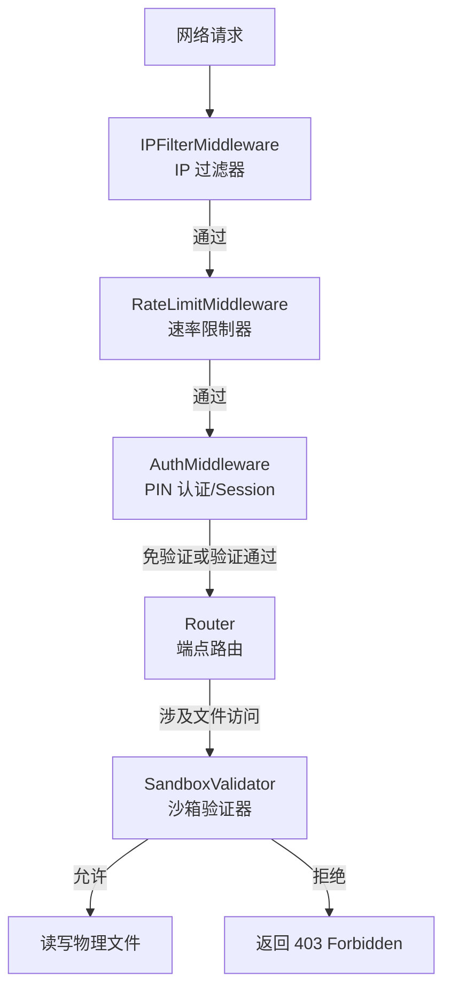

# 模块 03 — 安全与访问控制 (Security & Access Control)

> 对应 URS §2.3  
> 负责 IP 访问控制、PIN 码验证、路径沙箱防遍历越界、速率限制中间件

---

## 1. 模块职责边界



---

## 2. 子模块设计

### 2.1 IP 访问控制 (IPFilter)

**文件位置**: `server/src/security/ip-filter.ts`

**职责**:
- 解析客户端 IP 并与配置中的黑白名单进行比对
- 支持 IP CIDR 子网范围匹配（如 `192.168.1.0/24`）
- 拒绝不在白名单中或处于黑名单中的请求，返回 `403 Forbidden`

**IP 解析策略**:
- 读取 Elysia 的 `request.headers` 或 Web API 的 `connInfo.remote.address`
- 处理代理头（如存在 `X-Forwarded-For`、`X-Real-IP`），仅在配置了 `trustProxy` 时启用，默认局域网直连不启用以防伪造

**CIDR 匹配算法**:
- 将 IPv4 地址和掩码转换为 32 位无符号整数进行位运算：
  ```typescript
  function ipToLong(ip: string): number {
    return ip.split('.').reduce((ipInt, octet) => (ipInt << 8) + parseInt(octet, 10), 0) >>> 0;
  }
  
  function matchCIDR(ip: string, cidr: string): boolean {
    const [range, bitsStr] = cidr.split('/');
    const bits = bitsStr ? parseInt(bitsStr, 10) : 32;
    const ipInt = ipToLong(ip);
    const rangeInt = ipToLong(range);
    
    if (bits === 0) return true;
    const mask = (~(2 ** (32 - bits) - 1)) >>> 0;
    return (ipInt & mask) === (rangeInt & mask);
  }
  ```
- 支持 IPv6 本地回环地址和映射（如 `::1`, `::ffff:127.0.0.1`）统一标准化为 IPv4 或进行对应规则比对。

**白名单/黑名单逻辑**:
- 如果配置了白名单且不为空，仅允许匹配白名单的 IP，其余全部拒绝。
- 如果配置了黑名单，任何匹配黑名单的 IP 均被拒绝。
- 默认允许 `127.0.0.1` 和 `::1` 本地访问。

---

### 2.2 PIN 码身份验证 (PINAuthenticator)

**文件位置**: `server/src/security/auth.ts`

**职责**:
- 校验客户端请求是否携带有效的身份令牌（Cookie 或 Header）
- 提供 PIN 码比对、加密存储与 Session 签名生成
- 对免验证白名单端点直接放行

**安全性增强设计**:
- **加盐哈希存储**: 服务端配置文件或数据库中存储的 PIN 码必须使用 `Bun.password` 哈希存储，绝不能为明文。
- **Session 令牌**: 使用 JWT 或本地内存会话表维护 Session。如果是 JWT，密钥在启动时在内存中随机生成（若重启则局域网客户端需重新登录，保障安全性）；如果是本地内存 Session，维护一个 `Map<token, expireTime>`。
- **防止爆破**: 针对 `/api/pin` 验证接口设置极高的限流门槛和延迟惩罚，验证失败一次延迟 1 秒返回。

**验证拦截逻辑**:
- 免验证白名单包括：`/api/pin` (POST), `/api/ip` (GET), 以及静态前端资源（`/`, `/assets/*` 等，防止用户因未登录无法访问身份墙界面）。
- 对其他 API 端点：
  1. 读取请求头 `Authorization: Bearer <token>` 或 Cookie `msp_session=<token>`。
  2. 若 Token 缺失或无效，返回 `401 Unauthorized`，客户端自动跳转到 PIN 锁屏界面。

---

### 2.3 路径防越界沙箱 (SandboxValidator)

**文件位置**: `server/src/security/sandbox.ts`

**职责**:
- 验证所有传入的物理路径或经由 ID 转换得到的物理路径是否确实落在已注册的任意一个共享目录下。
- 防范路径遍历漏洞（如包含 `../` 或符号链接指向外部文件）。

**沙箱验证算法**:
```typescript
import { resolve, relative, isAbsolute } from "path";

export function validatePathInShares(targetPath: string, allowedShares: string[]): boolean {
  // 1. 标准化目标路径（解析软链接、解析相对路径如 ..）
  const resolvedTarget = resolve(targetPath);
  
  for (const sharePath of allowedShares) {
    const resolvedShare = resolve(sharePath);
    
    // 2. 计算目标路径相对于共享目录的相对路径
    const rel = relative(resolvedShare, resolvedTarget);
    
    // 3. 判断相对路径是否不以 .. 开头，且不是绝对路径（Windows 下跨盘符判定）
    const isInside = rel && !rel.startsWith('..') && !isAbsolute(rel);
    
    // 4. 判定是否为同一个目录本身
    const isSame = resolvedTarget === resolvedShare;
    
    if (isInside || isSame) {
      return true;
    }
  }
  return false;
}
```

**设计要点**:
- 所有的流传输端点（`/api/stream`）、缩略图（`/api/thumbnail`）、外挂字幕转换（`/api/subtitle`）在读取本地文件前，**必须且强制**调用此校验方法。
- 校验失败直接抛出异常，返回 `403 Forbidden` 并记录 SECURITY 警告日志。

---

### 2.4 服务端限流 (RateLimiter)

**文件位置**: `server/src/security/rate-limiter.ts`

**职责**:
- 采用令牌桶（Token Bucket）或滑动窗口（Sliding Window）算法限制单 IP 请求频率。
- 防范暴力破解 PIN 码和恶性 DDoS 请求。

**限流策略**:
- 基础限流：单 IP 每秒最大 50 个请求，桶大小 100。
- 安全接口限流（`/api/pin`）：单 IP 每分钟最大 5 次尝试，超出即锁定该 IP 10 分钟。
- 静态资源与大文件流传输端点跳过限流（防止流式转码/长视频请求被误杀）。

**实现方式**:
- 内存级轻量缓存（使用极简的 JavaScript 对象或 Map 记录 IP 窗口状态）。
- 定时清理过期 IP 状态，防止内存泄露。

---

## 3. 安全日志规范

为了便于故障排查和安全审查，安全模块将触发以下特定格式的日志：
- `[SECURITY] [BLOCKED_IP] Remote address {ip} blocked by filter rules.`
- `[SECURITY] [AUTH_FAILED] Failed PIN attempt from {ip}, delay triggered.`
- `[SECURITY] [PATH_TRAVERSAL] Blocked traversal attempt to {path} from {ip}.`
- `[SECURITY] [RATE_LIMITED] Too many requests from {ip} on {endpoint}.`
