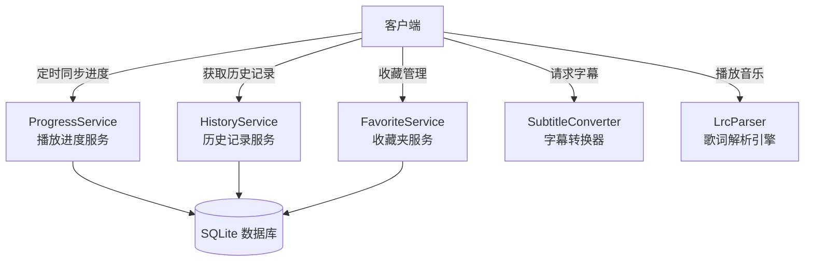

# 模块 04 — 个性化与辅助功能 (UX & Personalization)

> 对应 URS §2.4  
> 负责跨设备断点续播、播放历史、收藏夹管理、字幕在线转换、歌词同步滚动与前端虚拟化目录树

---

## 1. 模块职责边界



---

## 2. 子模块设计

### 2.1 播放进度与历史记录服务 (Progress & History)

**文件位置**: `server/src/services/playback-service.ts`

**职责**:
- 接收客户端定时上报的视频/音频播放时间戳，持久化到 SQLite 数据库。
- 合并“历史记录”与“未完成进度”，在主页优雅展示最近的历史面板。
- 视频开始播放时，自动匹配并提供上次进度。

**数据库表定义**:
见 `07-database-schema.md` 中的 `playback_progress` 表，记录 `mediaId`、`time` (秒) 和 `updatedAt`。

**播放进度上报流程**:
- 客户端播放器每 5 秒发送一次 `POST /personal/progress`，携带 `{ id: string, time: number }`。
- 如果播放到媒体总时长的 95% 以上，服务端和客户端均视为“已播放完”，在进度表中清理该记录，以防历史面板被已看过的视频占满，但更新 `updatedAt` 以保留历史足迹。

**历史记录恢复逻辑**:
- 当客户端打开某个媒体时，调用 `GET /personal/progress?id=xxx`。
- 若进度存在（如上次看至 `120.5` 秒），前端播放器初始化时自动 `currentTime = 120.5`，并在界面弹出提示 Toast/按钮：“已为您自动跳转到上次播放位置 {120.5}”。

---

### 2.2 收藏夹服务 (FavoriteService)

**文件位置**: `server/src/services/favorite-service.ts`

**职责**:
- 提供媒体收藏的 CRUD 操作。
- 状态在 SQLite 中持久化，支持跨设备同步。

**接口约定**:
- `POST /personal/favorites` 携带 `{ id: string }`
- `DELETE /personal/favorites` body 携带 `{ id: string }` 移除收藏
- `GET /personal/favorites` 获取全部收藏，通过 Join 查询 `media_items` 表，返回完整的 `MediaItem[]`。

---

### 2.3 字幕在线转换器 (SubtitleConverter)

**文件位置**: `server/src/services/subtitle-converter.ts`

**职责**:
- 读取物理字幕文件（SRT / ASS / SSA），实时转换为浏览器原生支持的 WebVTT 格式。
- 以流的形式返回给客户端。

**WebVTT 转换算法**:
- **SRT 转 VTT**: 
  1. 写入 VTT 头部 `WEBVTT\n\n`。
  2. 匹配时间戳格式：将 `,`（SRT 毫秒分隔符）替换为 `.`（VTT 毫秒分隔符）。
  3. 逐行输出。
- **ASS/SSA 转 VTT**:
  1. 解析 `[Events]` 段落。
  2. 提取 `Start`, `End`, `Text` 字段。
  3. 过滤 ASS 特效标签（如 `{\pos(100,100)}`, `{\fad(100,100)}` 等正则过滤 `/\{.*?\}/g`）。
  4. 按 WebVTT 时间戳和格式拼接输出。

**实现示例**:
```typescript
export function srtToVtt(srtContent: string): string {
  // 标准化换行，添加头
  let vtt = "WEBVTT\n\n";
  // 将 SRT 的时间戳格式 00:01:20,000 --> 00:01:23,000
  // 转换为 VTT 格式 00:01:20.000 --> 00:01:23.000
  vtt += srtContent.replace(/(\d{2}:\d{2}:\d{2}),(\d{3})/g, '$1.$2');
  return vtt;
}
```

**缓存策略**:
- 转换结果直接通过内存或临时管道输出，由于文本极小，不进行磁盘级缓存，每次请求实时转换。
- 输出 HTTP 响应头：`Content-Type: text/vtt; charset=utf-8`。

---

### 2.4 LRC 歌词同步解析器 (LrcParser)

**文件位置**: `client/src/lib/player/lrc-parser.ts`（纯前端模块）

**职责**:
- 在客户端下载侧边歌词文件并解析为带时间轴的结构体数组。
- 监听播放进度，触发平滑的歌词居中滚动（URS §2.4.4）。

**LRC 解析结构**:
```typescript
interface LyricLine {
  time: number; // 秒数
  text: string; // 歌词文本
}
```

**解析算法**:
- 使用正则表达式解析 `[mm:ss.xx]歌词内容`：
  ```typescript
  const lyricRegex = /\[(\d{2}):(\d{2})\.(\d{2,3})\](.*)/;
  ```
- 支持单行存在多个时间戳（如 `[00:12.00][01:30.00]副歌歌词`）。
- 解析后按时间升序排序。

**居中滚动渲染与动画实现**:
- 前端使用 Svelte 的 `$effect` 监视播放器的 `currentTime`。
- 动态匹配当前时间所处的歌词行：满足 `time <= currentTime` 且 `time` 最大。
- **平滑居中滚动**:
  获取当前高亮行 DOM 元素，通过计算容器高度，使用原生 JS `element.scrollIntoView({ behavior: 'smooth', block: 'center' })` 进行垂直居中滚动，避免卡顿。

---

### 2.5 客户端虚拟目录树构建 (VirtualDirectoryTree)

**文件位置**: `client/src/lib/utils/directory-builder.ts`（纯前端模块）

**职责**:
- URS §2.4.3 要求：为了减轻服务器磁盘 IO 压力，服务端仅返回平面列表，前端根据 `shareLabel` 和 `relPath` 在浏览器内存中虚拟构建文件夹层级。

**树节点定义**:
```typescript
interface FolderNode {
  name: string;
  relPath: string;     // 当前节点相对路径
  isDir: boolean;
  children: FolderNode[];
  items: MediaItem[];  // 该层级下的文件
}
```

**构建算法**:
```typescript
export function buildVirtualTree(items: MediaItem[]): Map<string, FolderNode> {
  const roots = new Map<string, FolderNode>(); // shareLabel -> RootNode
  
  for (const item of items) {
    if (!roots.has(item.shareLabel)) {
      roots.set(item.shareLabel, { name: item.shareLabel, relPath: "", isDir: true, children: [], items: [] });
    }
    const root = roots.get(item.shareLabel)!;
    
    // 按 relPath 的 '/' 分割，递归插入子目录
    const parts = item.relPath.split('/').filter(Boolean);
    let currentNode = root;
    
    for (let i = 0; i < parts.length - 1; i++) {
      const part = parts[i];
      let subFolder = currentNode.children.find(c => c.name === part);
      if (!subFolder) {
        subFolder = {
          name: part,
          relPath: parts.slice(0, i + 1).join('/'),
          isDir: true,
          children: [],
          items: []
        };
        currentNode.children.push(subFolder);
      }
      currentNode = subFolder;
    }
    
    // 插入媒体条目到最内层目录
    currentNode.items.push(item);
  }
  
  return roots;
}
```

**导航逻辑**:
- 前端通过维护一个“当前虚拟路径栈” `currentPath: string[]` 控制目录的点进和返回。
- 路径切换完全基于 Svelte 状态机，无需发送任何额外的网络请求，带来极致瞬开体验。
