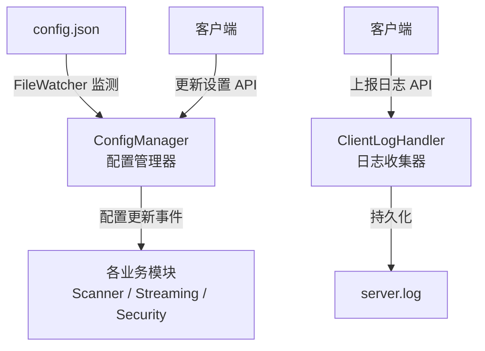

# 模块 05 — 管理与配置系统 (Management & Configuration)

> 对应 URS §2.5  
> 负责配置项热重载（免重启）、系统设置持久化、前端日志收集

> [!NOTE]
> 本文档为设计规格。当前实际实现状态：
> - **ConfigManager** (`config/manager.ts`) 已实现，支持 JSON 配置加载与 `fs.watch` 热重载
> - **管理 API** (`/config`, `/shares`) 尚未实现，配置需手动编辑 `packages/server/data/config.json`
> - **前端日志收集** (`/log`) 尚未实现

---

## 1. 模块职责边界



---

## 2. 子模块设计

### 2.1 配置管理器与实时热重载 (ConfigManager)

**文件位置**: `server/src/config/config-manager.ts`

**职责**:
- 读取、解析和写入服务端的 `config.json` 配置文件。
- 启动磁盘监听，在配置文件发生手动更改时触发内存热更新，实现**零重启应用新配置**。

**配置文件结构 (`config.json`)**:
```json
{
  "port": 4747,
  "shares": [
    { "label": "电影", "path": "/media/movies", "enabled": true }
  ],
  "security": {
    "pin": "$bcrypt$...",
    "trustedIps": ["192.168.1.0/24", "127.0.0.1"],
    "rateLimit": { "maxReqPerSec": 50 }
  },
  "blacklist": {
    "extensions": ["log", "tmp"],
    "filenames": ["desktop.ini"],
    "directories": [".git"],
    "maxSizeBytes": 10737418240
  },
  "streaming": {
    "maxTranscodeJobs": 2,
    "hwAccelPreferred": "auto"
  }
}
```

**磁盘监听与防抖逻辑**:
- 使用 Bun 原生的 `fs.watch` 或轮询 `fs.stat` 修改时间（在 Windows/Linux 环境下更稳定）。
- **防抖 (Debounce)**: 防止文本编辑器保存时触发多次事件，设置 500ms 防抖。
- 当监听到文件变更：
  1. 重新读取文件内容并执行 `JSON.parse`。
  2. 验证配置数据格式与字段类型是否合法。
  3. 若合法，替换内存中的全局配置实例。
  4. 发出事件广播（如使用简单的 EventEmitter），通知各订阅模块（Scanner、Security、RateLimiter）动态更新内存规则。

---

### 2.2 配置读写 API

**端点设计**:
- `GET /api/config`: 返回当前服务端非敏感配置（自动过滤 `security.pin`，防泄露）。
- `POST /api/config`: 校验格式后写入并覆盖 `config.json`，主动触发 ConfigManager 更新，无缝热应用。
- `POST /api/shares`: 专门用来快速添加/删除共享目录的原子操作，合并更新并写入配置文件。

---

### 2.3 前端日志收集器 (ClientLogHandler)

**文件位置**: `server/src/utils/logger.ts`

**职责**:
- 接收客户端上报的解码异常、网络异常等日志，统一写入服务端的日志流中，便于管理员排障。

**接口约定**:
- `POST /api/log` 携带数据：
  ```typescript
  interface ClientLogPayload {
    level: "warn" | "error";
    message: string;
    stack?: string;
    userAgent: string;
    mediaId?: string; // 若是在播放某个媒体时出错
  }
  ```

**写入日志规范**:
- 统一写入到服务端的主日志文件 `data/server.log`。
- 日志格式包含 `[CLIENT]` 标签：
  `[2026-05-20 01:34:00] [CLIENT] [ERROR] [IP: 192.168.1.50] Decoder Error on Media ID 1a2b3c4d: Format not supported. UA: Mozilla/5.0...`
- 为防止客户端由于代码死循环疯狂调用该 API 导致日志爆仓，对该端点实施每分钟最大 10 次的严苛限流。
