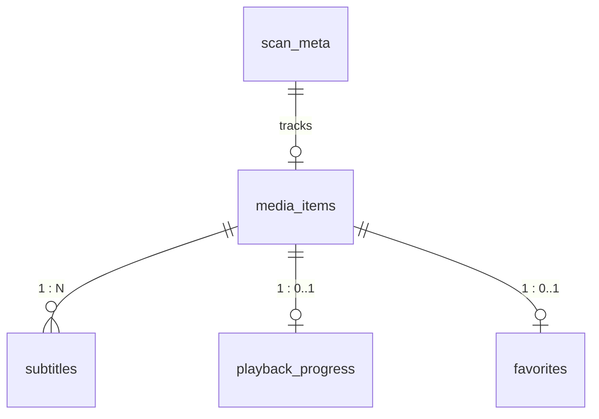

# 模块 07 — 数据库设计与持久化层 (Database Schema & DAO)

> 对应 URS §4  
> 负责 SQLite 物理表结构、索引优化、全量扫描数据入库策略和轻量级 DAO 封装

> [!NOTE]
> 本文档为设计规格。当前实际实现采用了简化版本：
> - `media_items` 表字段名为 camelCase（`relPath`, `shareLabel`, `modTime`, `coverId`, `lyricsId`），字幕以 JSON 字符串存储在 `subtitles` 字段中，未使用独立的 `subtitles` 表
> - `playback_progress` 和 `favorites` 表结构基本一致
> - 未实现 `scan_meta` 表

---

## 1. 数据库选型与配置

- **引擎**: Bun 内置的 `bun:sqlite`。
- **运行模式**: 开启 **WAL (Write-Ahead Logging)** 模式，提高读写并发吞吐。
- **连接管理**: 采用单实例长连接管理。
- **文件路径**: `data/mspr.db`，在服务启动时自动检查父目录并初始化。

---

## 2. 物理表结构设计



### 2.1 媒体项表 (media_items)

存储扫描得到的媒体元数据。

```sql
CREATE TABLE IF NOT EXISTS media_items (
    id TEXT PRIMARY KEY,               -- 相对路径 SHA256 前16位
    abs_path TEXT NOT NULL,            -- 物理绝对路径（禁止 API 返回）
    rel_path TEXT NOT NULL,            -- 相对共享目录的路径
    name TEXT NOT NULL,                -- 去除后缀的文件名
    ext TEXT NOT NULL,                 -- 文件扩展名（小写，不带点）
    kind TEXT NOT NULL,                -- video | audio | image | other
    share_label TEXT NOT NULL,         -- 共享目录别名
    size INTEGER NOT NULL,             -- 文件大小（字节）
    mod_time INTEGER NOT NULL,         -- 文件修改时间戳 (ms)
    cover_id TEXT,                     -- 关联封面 ID (音频专用)
    lyrics_id TEXT,                    -- 关联歌词 ID (音频专用)
    created_at INTEGER NOT NULL        -- 索引入库时间
);

-- 索引：加速按分类、共享别名和修改时间查询
CREATE INDEX IF NOT EXISTS idx_media_kind ON media_items(kind);
CREATE INDEX IF NOT EXISTS idx_media_share ON media_items(share_label);
CREATE INDEX IF NOT EXISTS idx_media_mod_time ON media_items(mod_time DESC);
```

### 2.2 外挂字幕表 (subtitles)

记录视频文件的关联字幕信息。

```sql
CREATE TABLE IF NOT EXISTS subtitles (
    id TEXT PRIMARY KEY,
    media_id TEXT NOT NULL,            -- 关联的 media_items.id
    label TEXT NOT NULL,               -- 字幕显示标签（如 "Chinese(zh)"）
    lang TEXT,                         -- 语言简写（如 "zh", "en"）
    abs_path TEXT NOT NULL,            -- 字幕物理绝对路径
    is_default INTEGER DEFAULT 0,      -- 是否默认字幕 (0 或 1)
    FOREIGN KEY(media_id) REFERENCES media_items(id) ON DELETE CASCADE
);

CREATE INDEX IF NOT EXISTS idx_sub_media ON subtitles(media_id);
```

### 2.3 播放进度表 (playback_progress)

记录跨设备媒体播放位置。

```sql
CREATE TABLE IF NOT EXISTS playback_progress (
    media_id TEXT PRIMARY KEY,         -- 关联的 media_items.id
    time REAL NOT NULL,                -- 播放进度（秒）
    updated_at INTEGER NOT NULL,       -- 最后更新时间戳 (ms)
    FOREIGN KEY(media_id) REFERENCES media_items(id) ON DELETE CASCADE
);

CREATE INDEX IF NOT EXISTS idx_progress_updated ON playback_progress(updated_at DESC);
```

### 2.4 收藏夹表 (favorites)

记录收藏的媒体 ID。

```sql
CREATE TABLE IF NOT EXISTS favorites (
    media_id TEXT PRIMARY KEY,         -- 关联的 media_items.id
    created_at INTEGER NOT NULL,       -- 收藏时间戳
    FOREIGN KEY(media_id) REFERENCES media_items(id) ON DELETE CASCADE
);
```

### 2.5 扫描状态元数据表 (scan_meta)

```sql
CREATE TABLE IF NOT EXISTS scan_meta (
    key TEXT PRIMARY KEY,              -- 如 "last_scan_id", "complete"
    value TEXT NOT NULL
);
```

---

## 3. 扫描入库事务与性能优化

为了解决扫描万级文件可能带来的写入瓶颈，必须实施 **批量事务提交** 策略。

### 3.1 全量覆盖扫描入库算法

```typescript
import { Database } from "bun:sqlite";

export function saveScanResult(db: Database, items: MediaItem[], subs: Subtitle[]) {
  // 1. 开启显式事务，将随机写入聚合成单次磁盘 IO
  db.run("BEGIN TRANSACTION");
  
  try {
    // 2. 清理旧的媒体元数据（级联删除会自动清理 subtitles, progress 进度关联）
    // 为了防止用户的历史进度被误删，采用保留进度表的删除逻辑：
    // 只清理 media_items，但对于 progress 进度表中有记录的媒体，如果不复存在了才由垃圾回收清理。
    db.run("DELETE FROM media_items");
    
    // 3. 编译批量插入语句 (Prepared Statement)
    const insertMedia = db.prepare(`
      INSERT INTO media_items (id, abs_path, rel_path, name, ext, kind, share_label, size, mod_time, cover_id, lyrics_id, created_at)
      VALUES ($id, $abs_path, $rel_path, $name, $ext, $kind, $share_label, $size, $mod_time, $cover_id, $lyrics_id, $created_at)
    `);
    
    const insertSub = db.prepare(`
      INSERT INTO subtitles (id, media_id, label, lang, abs_path, is_default)
      VALUES ($id, $media_id, $label, $lang, $abs_path, $is_default)
    `);
    
    // 4. 循环绑定数据并执行
    for (const item of items) {
      insertMedia.run({
        $id: item.id,
        $abs_path: item.absPath,
        $rel_path: item.relPath,
        $name: item.name,
        $ext: item.ext,
        $kind: item.kind,
        $share_label: item.shareLabel,
        $size: item.size,
        $mod_time: item.modTime,
        $cover_id: item.coverId,
        $lyrics_id: item.lyricsId,
        $created_at: Date.now()
      });
    }
    
    for (const sub of subs) {
      insertSub.run({
        $id: sub.id,
        $media_id: sub.mediaId,
        $label: sub.label,
        $lang: sub.lang,
        $abs_path: sub.absPath,
        $is_default: sub.isDefault ? 1 : 0
      });
    }
    
    // 5. 更新扫描元状态
    db.run("INSERT OR REPLACE INTO scan_meta (key, value) VALUES ('last_scan_time', ?)", [Date.now().toString()]);
    db.run("INSERT OR REPLACE INTO scan_meta (key, value) VALUES ('scan_complete', '1')");
    
    // 6. 提交事务
    db.run("COMMIT");
  } catch (error) {
    db.run("ROLLBACK");
    throw error;
  }
}
```

**性能表现预期**:
- 采用 WAL + Transactions + Prepared Statements，万级记录的写入在 150ms 内即可提交完毕。
- 常驻内存占用极小。
- 数据检索通过 Index 进行 B-Tree 查找，耗时均在 1ms 以内。

---

## 4. 实施弹性说明 (Implementation Flexibilities)

*   **ORM 与数据库驱动替代**: 文档示例使用原生 `bun:sqlite`。在实际实施中，AI 可以根据技术链喜好或为了方便集成 migrations，自主选择 `better-sqlite3`（配合 Node.js）、`Prisma`、`Drizzle ORM`、`GORM` 或 `Kysely`。
*   **外键约束级联处理**: 若所选 ORM 或 SQLite 驱动未开启外键级联删除支持（`PRAGMA foreign_keys = ON`），AI 应当在删除 `media_items` 时，显式编写删除 `subtitles`、`playback_progress`、`favorites` 中对应关联项的 SQL 代码，避免脏数据残留导致级联失效。
*   **字段类型微调**: SQLite 不支持原生 Date/Boolean 类型。文档中 `is_default` 采用 `INTEGER (0/1)`，`created_at` 采用 `INTEGER` (时间戳)。AI 在编写 schema 时可以根据使用的 ORM 模型转换能力，灵活定义这些字段的逻辑表达方式（如使用 TEXT 存储 ISO-8601 时间串或直接用 NUMERIC）。

