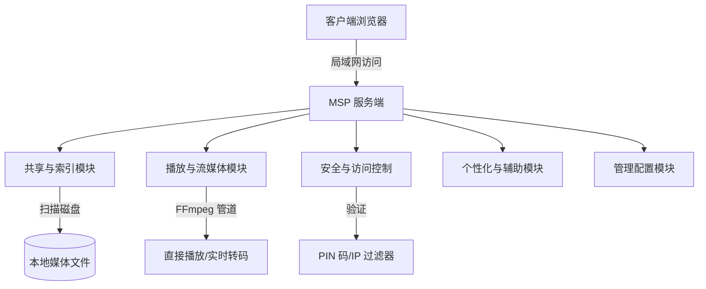
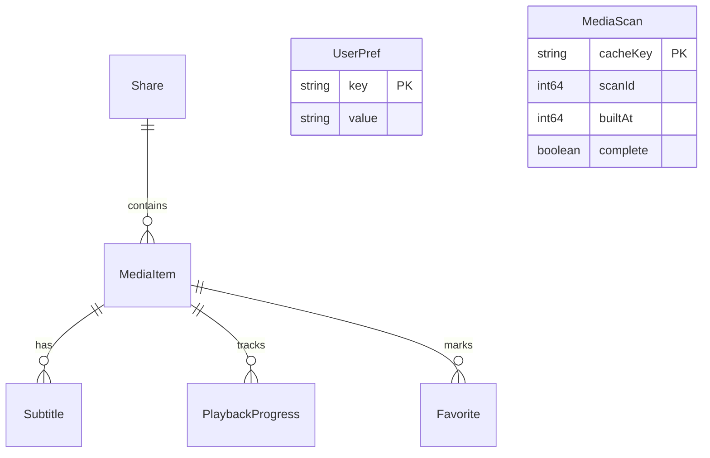

# MSP (Media Share & Preview) 媒体服务器用户需求规格说明书 (URS)

> [!NOTE]
> 本文档旨在从用户与业务逻辑的视角抽象出系统的核心诉求，屏蔽了具体的编程语言（如 Go、Vite 等）和底层库（如 GORM 等）的技术细节。以便在未来决定使用其他开发框架（如 Node.js, Rust, Python, Tauri/Electron 等）进行重写时，能有一个清晰的、保留最大灵活性但定义明确的核心规范。

---

## 1. 项目定位与核心原则

### 1.1 系统定位
MSP 是一个面向家庭或小型局域网的**极简媒体分享与预览服务器**。用户只需在主机上启动服务端程序，即可在同局域网的其他设备（手机、平板、电视、其他电脑）上通过浏览器直接访问、搜索并播放主机上的视频、音频、图片以及管理各类文档。

### 1.2 核心设计原则
*   **零配置与极简启动**：免除外部繁重的数据库依赖（如 MySQL、PostgreSQL）及复杂的安装过程，支持“开箱即用”。
*   **本地优先与隐私保护**：系统完全运行于本地网络，不依赖云端账户，无数据追踪，确保用户媒体库的绝对隐私。
*   **多端兼容与流式适配**：客户端面向标准现代 Web 浏览器，避免安装专用客户端，服务端提供智能流媒体适配。
*   **高性能与低资源占用**：静态资源与二进制结合，轻量级文件扫描与流式转码（不写临时文件），降低宿主机的 CPU 与磁盘 IO 负载。

---

## 2. 核心功能需求

系统功能从逻辑上可以划分为五大模块：共享与索引模块、播放与流媒体模块、安全与访问控制模块、个性化与辅助模块，以及管理配置模块。



---

### 2.1 共享目录与媒体索引模块 (Shares & Indexing)

#### 2.1.1 共享目录注册
*   **路径别名**：用户可以添加任意数量的物理目录路径作为共享目录，并为每个目录指定一个别名（Label），便于客户端分类浏览。
*   **虚拟化逻辑**：客户端不直接暴露系统的物理盘符，而统一以共享目录的别名作为虚拟根目录进行展示。

#### 2.1.2 智能分类扫描
*   **文件分类规则**：系统在扫描文件时，应自动根据后缀名将文件归入以下四大主类及“其他”类别：
    
    | 分类 | 典型支持扩展名 |
    | :--- | :--- |
    | **视频 (Video)** | `.mp4`, `.mkv`, `.avi`, `.mov`, `.wmv`, `.flv`, `.webm`, `.ts`, `.m4v` |
    | **音频 (Audio)** | `.mp3`, `.wav`, `.flac`, `.aac`, `.ogg`, `.m4a`, `.wma`, `.ape` |
    | **图片 (Image)** | `.jpg`, `.jpeg`, `.png`, `.gif`, `.webp`, `.bmp`, `.svg` |
    | **其他 (Other)** | 以上未涵盖且未被黑名单过滤的常规文件 |

*   **元数据缓存**：为避免频繁扫描磁盘造成卡顿，系统应具备媒体信息缓存机制（如本地轻量级嵌入式数据库或状态文件），仅在手动触发刷新或检测到目录变更时更新缓存。

#### 2.1.3 灵活的黑名单过滤 (Blacklist Rules)
为防止扫描冗余、敏感或过大的文件，系统必须支持以下维度的屏蔽过滤规则，且支持**精确匹配**与**正则表达式**：
1.  **扩展名黑名单**：例如屏蔽 `.log`、`.tmp`、`.torrent` 等。
2.  **文件名黑名单**：例如屏蔽 `thumbs.db`、`desktop.ini`，或者匹配特定前缀 `/^tmp_/` 的文件。
3.  **目录黑名单**：例如跳过 `$RECYCLE.BIN`、`.git` 等目录。
4.  **文件大小屏蔽**：支持配置过滤范围，例如“屏蔽小于 `1MB`”或“屏蔽大于 `10GB`”的文件。支持大小单位解析（B, KB, MB, GB, TB）。

#### 2.1.4 侧边辅助文件扫描 (Sidecars)
*   **字幕文件 (Subtitles)**：自动扫描视频同目录下同名（或包含语言标识前缀）的字幕文件（如 `.srt`, `.vtt`, `.ass`）。
*   **歌词文件 (Lyrics)**：自动扫描音频同目录下的侧边歌词文件（如 `.lrc`），用于播放时同步歌词展示。
*   **音频封面 (Covers)**：自动扫描音频同目录下的关联封面图片（如 `cover.jpg`、`folder.png` 等，或与音频同名的图片文件）。

---

### 2.2 播放与流媒体模块 (Streaming & Intelligent Transcoding)

#### 2.2.1 智能播放策略决策 (Playback Decision Engine)
系统不能一刀切地对所有媒体进行转码或直连，应当建立“基于浏览器兼容性特征的决策树”：

```
                    [ 客户端请求媒体探针 API ]
                               │
                ┌──────────────┴──────────────┐
                ▼                             ▼
       [ 开启转码功能并发现 FFmpeg ]    [ 关闭转码或缺少 FFmpeg ]
                │                             │
    ┌───────────┴───────────┐                 └──────────────┐
    ▼                       ▼                                ▼
[文件编码被主流浏览器支持]  [文件编码不兼容]                     [回退方案]
    │                       │                                │
    ▼                       ▼                                ▼
[直接播放 (Direct Play)]   [流式转码 (Transcoding)]      [强制直接播放 (直连)]
```

*   **直连播放策略**：当文件封装格式（如 MP4, WebM）与编码（如 H.264, AAC）兼容主流浏览器时，优先直接传输原始文件数据，避免不必要的 CPU 消耗。
*   **智能转码触发**：仅在检测到高风险封装格式（如 AVI, WMV）或主流浏览器不支持的视音频编码（如 H.265/HEVC 部分情况、VC-1、AC-3、DTS、TrueHD 等）时，才触发后台转码。
*   **直连容错重试**：若客户端直连播放失败，客户端应能自动发起一次回退转码重试（需服务端提供转码端点），提升播放成功率。

#### 2.2.2 流式实时转码机制
*   **无磁盘开销设计**：转码输出流必须直接通过流管道（Pipe）向客户端传输，不能在服务端生成任何临时转码文件，避免大量读写机械硬盘或磨损固态硬盘。
*   **分块与快速启播**：使用分块传输（如 fragmented MP4）或支持 HTTP Range，使客户端即使在长视频转码时也能在数秒内开始播放。
*   **转码参数自动适配**：
    *   *视频转码*：将不支持的视频流转码为 `H.264`，如果原音轨不受浏览器支持，则将音频流实时重编码为 `AAC` 或 `MP3`；若原视音频流已兼容，则使用 `-vcodec copy` 或 `-acodec copy` 仅重包（Remux），最大化节省 CPU。
    *   *音频转码*：将不支持的音频转码为 `MP3`。

#### 2.2.3 硬件加速与并发控制 (HW Accel & Concurrency)
*   **硬解/硬编自适应**：服务端能够自动检测主机的硬件环境（如 Nvidia NVENC, Intel QSV, AMD AMF, macOS VideoToolbox, Linux VAAPI 等）。在转码时，优先采用硬件加速，若硬件不可用，自动平滑退避到 CPU 软件编码（如 libx264），确保转码不断流。
*   **转码并发上限保护**：提供并发转码任务上限控制（Max Jobs）。当达到上限时，后续转码请求将被礼貌地拒绝，防止服务端死机或过度消耗 GPU 资源。

#### 2.2.4 视频缩略图生成 (Thumbnails)
*   **动态生成与缓存**：视频列表中显示快照缩略图。服务端在被请求特定视频的缩略图时，利用后台工具（如 FFmpeg）在视频特定时间点截取一帧，并在服务端硬盘指定缓存区保存，后续请求直接命中缓存。

---

### 2.3 安全与访问控制模块 (Security & Middleware)

#### 2.3.1 IP 访问控制
*   **黑白名单过滤器**：允许用户配置受信任的 IP 地址或子网范围（支持 CIDR 格式，如 `192.168.1.0/24`）。不在白名单内或在黑名单内的局域网设备将被直接拒绝建立连接。

#### 2.3.2 PIN 码访问认证
*   **轻量身份墙**：当用户开启安全 PIN 验证时，所有局域网非免认证 API 请求必须携带有效 Session（通过 Cookie 或 Header 传递）。
*   **免验证白名单**：系统配置管理页面更新、服务端的局域网 IP 获取以及 PIN 认证端点本身，属于免登录认证接口。
*   **安全加密存储**：PIN 码在服务端的配置文件或数据库中**必须加密存储**（如使用 Bcrypt 或是加盐哈希），绝不能以明文保存。

#### 2.3.3 系统安全防护
*   **沙箱路径防越界**：服务端处理任何关于媒体流或缩略图的请求时，**必须严格验证**请求的目标绝对路径是否落在已注册的任一共享目录范围内，杜绝利用路径遍历（Path Traversal，如 `../../`）读取系统敏感文件。
*   **服务端速率限制 (Rate Limiting)**：针对请求频率进行限制，防范局域网设备由于逻辑死循环或恶性流量产生 DDoS 攻击服务端。

---

### 2.4 个性化与辅助功能模块 (UX & Personalization)

#### 2.4.1 跨设备断点续播 (Resume Progress)
*   **自动进度保存**：媒体播放过程中（视频/音频），客户端定时（如每隔数秒）向服务端汇报当前的播放进度（以秒为单位）。
*   **断点恢复提示**：当用户重新打开未播放完毕的视频/音频时，界面应提供“从上次播放处继续（如 xx:xx）”的明显悬浮按钮。

#### 2.4.2 播放历史 (Playback History)
*   **优雅的历史记录**：在主界面提供"播放历史"面板，按时间倒序记录用户的观看/收听历史。不采用"继续观看"模式（因为大量未看完的视频会导致列表膨胀）。
*   **自动进度恢复**：当用户点击之前未播放完毕的媒体时，系统自动从上次进度处恢复播放，无需单独的"继续观看"入口。

#### 2.4.3 目录树与扁平列表切换 (Browse Modes)
客户端需要支持两种不同的库文件展现形式：
1.  **扁平模式 (Flat)**：在指定分类下以分页的形式展示该分类的全部文件列表，方便结合全局搜索进行跨目录定位。
2.  **目录树模式 (Folder)**：
    *   *纯前端虚拟化构建*：为了减轻服务端的负担，客户端拿到完整的媒体文件平面列表后，在客户端浏览器本地根据文件的 `relPath` 和 `shareLabel` 虚拟构建出文件夹结构，并实现目录之间的点进与返回，无需多余的服务端磁盘 IO。

> [!IMPORTANT]
> 浏览模式的切换入口应放在**设置/配置页面**中，而非主界面。主页面应保持干净清爽，减少功能性元素的堆砌。

#### 2.4.4 字幕与歌词辅助渲染
*   **字幕在线转换**：由于浏览器仅支持标准的 WebVTT 字幕，服务端必须支持在传输字幕时，实时将常见字幕（如 SRT、ASS）转换为 VTT 格式并在客户端加载。
*   **歌词同步滚动**：当播放带侧边 LRC 歌词的音频文件时，前端应解析该歌词文件并在界面高亮展示。歌词随着音乐播放时间更新，自动定位到当前行并保持平滑的垂直居中滚动。

#### 2.4.5 收藏夹功能 (Favorites)
*   **跨设备收藏**：用户可以将任何视频、音频或图片标记为收藏。收藏记录保存在服务端，可在“收藏”专用选项卡中进行过滤展示。

---

### 2.5 管理配置模块 (Management & Hot Reload)

#### 2.5.1 配置实时热重载
*   **零重启机制**：服务端在后台启动定时监视器（如每隔 5 秒检查配置文件修改时间，或使用 OS 的 FileWatcher）。当用户手动修改或通过后台 API 更改了配置文件时，服务端应自动重新加载配置并应用（如端口、共享目录、黑名单过滤规则、安全策略等），无须用户重启服务器程序。

#### 2.5.2 前端日志上报
*   **集中式排障**：由于局域网播放可能因为设备浏览器兼容差异产生解码错误，系统应支持前端将运行错误（Error/Warn）自动上报给服务端，统一记录在服务端的日志文件中，方便管理员诊断。

---

## 3. 非功能性与客户端设计需求

### 3.1 客户端交互与视觉规范

系统应该提供极具 Wow 感的高级现代界面。
*   **自适应布局 (Responsive Design)**：兼容桌面大屏（侧边导航 + 右侧列表预览 + 右下角悬浮播放栏）和手机小屏（底部导航标签 + 列表流式展示 + 沉浸式全屏播放器）。
*   **色彩与主题系统 (Theme System)**：
    *   提供一套基于 HSL 动态色彩体系的“暗黑模式 (Dark Mode)”与“明亮模式 (Light Mode)”。
    *   避免单纯的高饱和度纯红、纯绿、纯蓝，使用和谐的渐变色、微妙的投影和现代玻璃态磨砂质感（Glassmorphism）。
*   **平滑的微动画 (Micro-Animations)**：
    *   在卡片悬浮、按钮点击、加载中状态引入轻量、跟手的 CSS 过渡与动画。
    *   播放器控制面板支持自动淡入淡出，歌词滚动支持 smooth 线性动画。
*   **全局快捷键支持 (Hotkeys)**：
    *   客户端应绑定全局快捷键（如空格暂停、左右方向键快进/快退 10s、上下方向键调节音量、F 键全屏等），提升极客体验。

### 3.2 性能指标
*   **极速扫描性能**：通过优化文件指针头判断（前置字节 Sniffing 探测）替代调用外部 FFProbe 工具，实现万级文件在数秒内扫描索引完毕。
*   **低内存占用**：服务端的常驻内存占用应控制在 50MB 以内（静态运行时），避免对宿主机电脑性能产生可察觉的影响。
*   **首屏秒开**：通过 ETag 缓存、静态资源压缩（Gzip/Brotli）使用户在局域网弱网环境下依然能瞬时渲染出文件结构。

---

## 4. 核心概念数据模型 (Conceptual Entity Schema)

> [!NOTE]
> 以下数据模型**仅供参考**，应按照实际实现方式与所选技术栈灵活构建，不作为强制约束。

重写此系统时，底层存储设计可参考以下实体模型之间的关系：



### 4.1 共享目录 (Share)
*   `label` (String, Unique): 共享目录的别名/显示标签。
*   `path` (String): 服务端主机上的物理绝对路径。

### 4.2 媒体条目 (MediaItem)
*   `id` (String, PK): 基于特定算法（例如对相对路径进行哈希，或加上密钥的可逆 ID，保证即使重置库也能确定性映射）生成的唯一标识符。
*   `path` (String, Sensitive): 文件在物理硬盘上的绝对路径（服务端使用，不可泄露至 API 响应中）。
*   `relPath` (String): 文件相对于该共享目录的相对路径，用于虚拟构建目录树。
*   `name` (String): 去除后缀的文件名。
*   `ext` (String): 文件扩展名（小写，不带点）。
*   `kind` (String): 媒体大类分类（`video` | `audio` | `image` | `other`）。
*   `shareLabel` (String): 所属共享目录的别名。
*   `size` (Integer): 文件大小（字节）。
*   `modTime` (Integer): 文件的修改时间戳。
*   `subtitles` (JSON Array): 外挂字幕元数据列表，每个元素包含 `id`、`label`、`lang`、`src`、`default`。
*   `coverId` (String, Optional): 关联封面文件的 ID（主要针对音频）。
*   `lyricsId` (String, Optional): 关联歌词文件的 ID（主要针对音频）。

### 4.3 播放进度 (PlaybackProgress)
*   `mediaId` (String, PK): 媒体条目 ID。
*   `time` (Float): 当前播放到的时间点（秒）。
*   `updatedAt` (DateTime): 进度最后更新时间。

### 4.4 收藏夹 (Favorite)
*   `mediaId` (String, PK): 媒体条目 ID。
*   `createdAt` (DateTime): 收藏时间。

---

## 5. 参考 API 端点与通讯契约 (Reference APIs)

> [!NOTE]
> 以下 API 设计**仅供参考**，应按照实际实现方式与所选技术栈灵活构建，不作为强制约束。

重写新系统时，前端与后端的通讯逻辑可参考以下 API 端点设计：

| 端点 (Endpoint) | 方法 (Method) | 安全级 (Auth) | 描述 |
| :--- | :--- | :--- | :--- |
| `/api/pin` | `POST` | 免验证 | 客户端输入 PIN 码验证，返回 `Session Token`。 |
| `/api/ip` | `GET` | 免验证 | 获取服务端的局域网 IP 地址列表。 |
| `/api/config` | `GET`/`POST` | 本地免验证/局域网鉴权 | 查看或更新服务端的基础配置参数。 |
| `/api/shares` | `POST` | 本地免验证/局域网鉴权 | 动态添加或删除共享目录路径。 |
| `/api/media` | `GET` | 鉴权验证 | 获取全量已分类的媒体条目数据，支持 `?refresh=1` 手动扫描。 |
| `/api/probe` | `GET` | 鉴权验证 | 探测视频或音频的实际编码，返回播放策略模式（`direct` 或 `transcode`）。 |
| `/api/stream` | `GET` | 鉴权验证 | 请求媒体流文件。支持传参 `?id=xxx&transcode=1&offset=0` 开启转码和进度定位。 |
| `/api/subtitle` | `GET` | 鉴权验证 | 加载并实时转换外挂字幕，返回标准的 WebVTT 格式。 |
| `/api/thumbnail` | `GET` | 鉴权验证 | 获取指定视频的缩略图（若不存在则后台生成并缓存）。 |
| `/api/progress` | `GET`/`POST` | 鉴权验证 | 保存或读取单项媒体条目的播放时间进度。 |
| `/api/progress/recent`| `GET` | 鉴权验证 | 获取最近播放未完成的视频列表（智能聚合主页用）。 |
| `/api/favorites` | `GET`/`POST`/`DELETE` | 鉴权验证 | 收藏管理列表及增删。 |
| `/api/prefs` | `GET`/`POST` | 鉴权验证 | 获取/保存用户的个性化偏好键值对。 |
| `/api/log` | `POST` | 鉴权验证 | 前端运行日志集中收集排障。 |

---

## 6. 重构技术栈与架构设计指南

本章为未来实施系统重写的开发者或 AI 提供技术架构层面的设计原则与推荐选型，保持高度灵活性，以实现最优的开发效率与运行体验。

### 6.1 核心架构选型原则
无论采用何种具体语言或框架，重构实现时均应遵循以下基础指标：
*   **宿主轻量化**：后端主程序应当尽可能保持低资源开销。常驻内存建议在 50MB-100MB 之间。
*   **部署单元整合**：客户端静态资源（如 HTML、JS、CSS、字体、图标）建议在打包阶段嵌入至后端执行文件内，交付产物为单二进制或单启动目录，以维护“开箱即用”体验。
*   **FFmpeg 生态依赖**：服务端应优先利用系统已有的 FFmpeg/FFprobe 可执行程序，通过调用子进程管道（Pipe）的形式进行流式音频/视频编码转换，不支持在没有 FFmpeg 时完全锁死直连播放。

---

### 6.2 灵活的技术方案对比

重构技术选型不受限制，以下提供三种典型生态方案以供灵活选择：

| 技术方案 | 后端/运行时环境 | 前端 UI 框架 | 存储方案 | 适用场景与优势 |
| :--- | :--- | :--- | :--- | :--- |
| **高开发效率方案 (Node/Bun)** | **Bun / Node.js** (Elysia, Express 或 Fastify) | **Svelte 5** / **Vue 3** / **React 19** (纯 SPA 模式，不采用 SSR) | 嵌入式 SQLite / 本地 JSON 状态文件 | 开发速度极快；Bun 具备原生的极速文件 I/O 与 SQLite，对 FFmpeg 子进程管道（`Bun.spawn`）有着极佳控制力。 |
| **极致性能方案 (Rust/Go)** | **Rust** (Axum, Actix-web) 或 **Go** (Fiber, Echo) | **Svelte 5** / **React** / **SolidJS** (编译为轻量级静态 assets 嵌入) | 嵌入式 SQLite | 运行性能与内存占用极低（约 15MB 左右）；可直接编译为无任何依赖的单文件，跨平台编译支持最完美。 |
| **桌面客户端方案 (Tauri/Wails)** | **Rust/Tauri** (v2) 或 **Go/Wails** | 同上 (以 WebView 渲染) | 本地配置 + 本地库 | 如果希望将此工具转为带原生托盘、系统通知、更强开机自启管理能力的本地桌面应用，这是一个极佳方向。 |

---

### 6.3 重写 AI 指令模版 (Prompt Directive Template for Rewrite AI)

若您计划借助其他 AI 编程辅助工具彻底重写本项目，可将以下 Prompt 模板与本 URS 报告一并提供给对方：

```text
================================================================================
ROLE: Senior Full-Stack Architect
TASK: Rewrite the MSP (Media Share & Preview) LAN Media Server.

[DIRECTIVE]
1. Read the provided User Requirements Specification (URS) carefully.
2. The core objective is to deliver a zero-configuration, privacy-first, and highly-performant local network media player with zero-copy stream transcoding (direct piping stdout from FFmpeg processes to HTTP responses).
3. Keep the user experience highly dynamic and visual: premium aesthetics (responsive, sleek dark mode, glassmorphism, smooth micro-animations).

[CHOOSE YOUR TECH STACK - Flexible but Recommended Option]:
- Backend/Runtime: Bun (or Node.js) with TypeScript.
  * Use Bun's native SQLite or file-based stores for user progress/history/favorites.
  * Spawn FFmpeg subprocesses via Bun.spawn() to stream transcoded audio/video directly.
- Frontend: Svelte 5 (strictly using Runes: $state, $effect) or Vue 3 / React (SPA mode only, no server-side rendering).
- UI/Styling: Tailwind CSS and shadcn components (or modern CSS utility frameworks).
- Animations: Smooth transitions for playback history panel, folder navigation, and synchronized lyrics scrolling.

[KEY LOGIC IMPLEMENTATION REQUIREMENTS]:
- Path Traversal Protection: Validate that all requested streaming, subtitle, or thumbnail paths reside inside the registered shares.
- Smart Probe & Playback Strategy: Query file headers first (sniffing) before fallback to ffprobe. Prioritize direct play; transcode to H.264/AAC fragmented MP4 stream dynamically when incompatible.
- Client-side Virtual Directory Tree: Do not request directories dynamically from the backend. The backend returns a flat media list; the frontend builds the folder structures locally.
- Synchronized LRC Lyric Scrolling: Parse LRC timestamp tags on the client and scroll elements smoothly to keep the active line centered.
================================================================================
```

